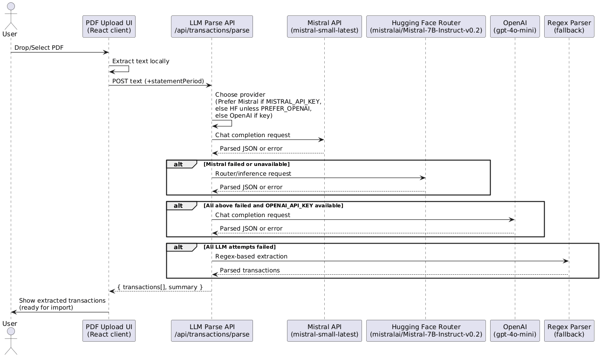
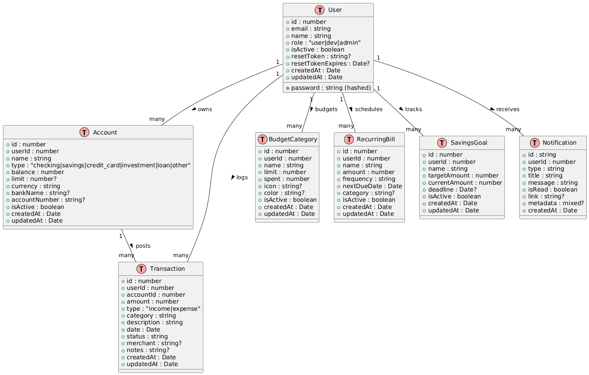
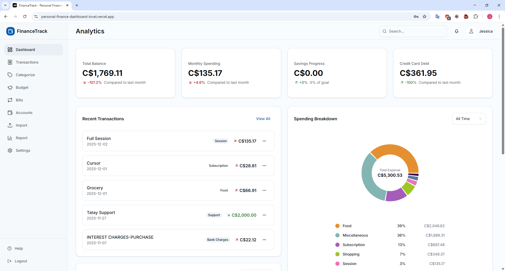
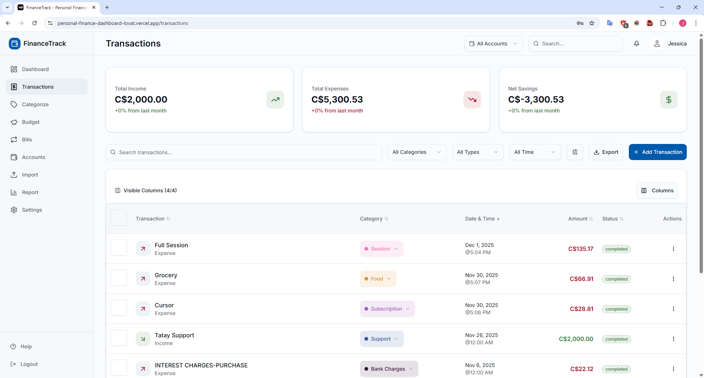
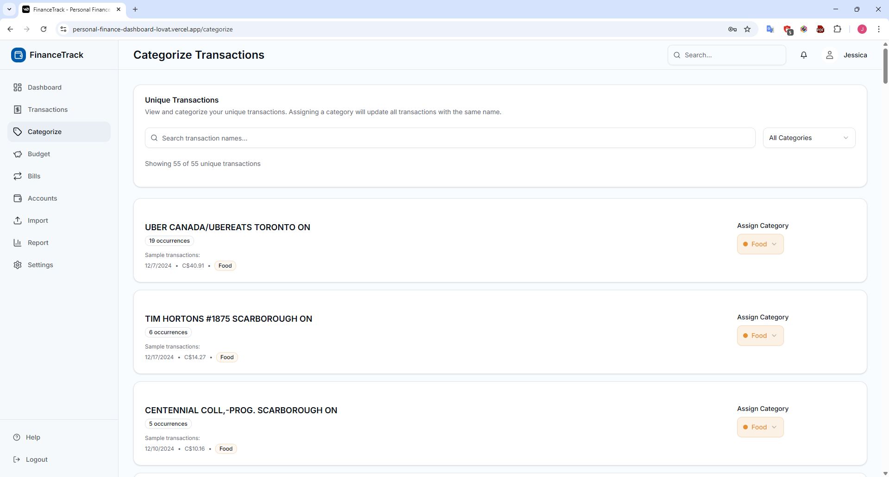
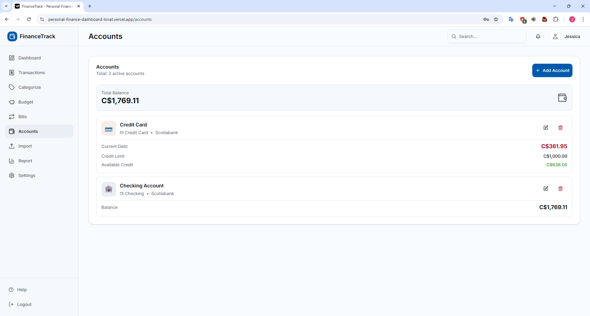
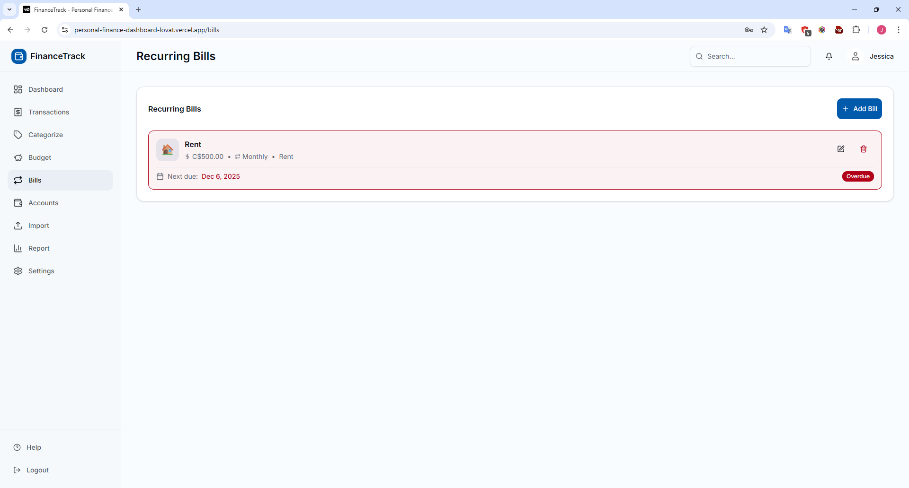
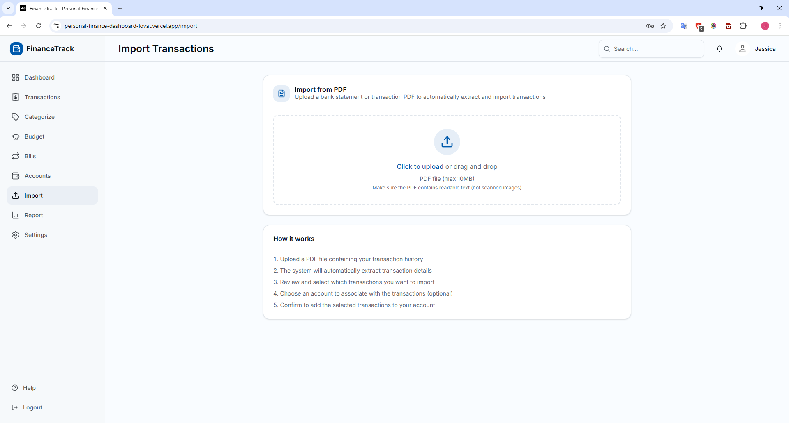

# Personal Finance Dashboard

Modern personal finance dashboard built with Next.js that tracks accounts, transactions, budgets, savings goals, recurring bills, and notifications using MongoDB.

## Features
- Dashboard with balances, monthly spending, category breakdown, and recent transactions.
- Accounts, transactions, categories, budgets, savings goals, recurring bills, and notifications.
- PDF import flow to extract and ingest transactions.
- Auth (login, signup) with password reset, onboarding, theming, and responsive layout components.
- MongoDB-backed persistence with role-aware DB selection (mock vs real).

## Tech Stack
- Next.js 16, React 19, TypeScript
- Tailwind CSS + Radix UI components
- MongoDB + Mongoose for data persistence

## Getting Started
### Prerequisites
- Node.js 18+ (LTS recommended)
- npm (repo ships with `package-lock.json`)
- MongoDB local or Atlas cluster

### Install
```bash
npm install
```

### Environment
Keep credentials in `.env.local` (never commit this file):
```env
# MONGODB_URI=mongodb://localhost:27017
MONGODB_URI=mongodb+srv://<user>:<password>@<cluster>/
HUGGINGFACE_API_KEY=hugging_face_api_key
MISTRAL_API_KEY=mistral_api_key
```
For local MongoDB, use `mongodb://localhost:27017` and adjust DB names as desired.

### Database Setup (local)
Ensure MongoDB is running locally (or connect to Atlas via `MONGODB_URI`).

### Run
```bash
npm run dev
# open http://localhost:3000
```

### Lint / Build
```bash
npm run lint
npm run build
npm start   # serves production build
```

### Tests
```bash
npm test    # runs node --test via tsx (see tests/*.test.ts)
```

## Auth and Password Reset
- Login: `POST /api/auth/login` with `email` and `password`.
- Signup: `POST /api/auth/signup` (role is forced to `user`).
- Forgot password: `POST /api/auth/forgot-password` with `email`; returns a dev token (since no email service is configured) along with expiry.
- Reset password: `POST /api/auth/reset-password` with `token` and `password` (min 6 chars). The public UI pages `/forgot-password` and `/reset-password` wrap these flows.

## Project Structure (high level)
- `app/` – Next.js routes (pages + API)
- `components/` – UI and dashboard widgets
- `lib/models/` – Mongoose schemas
- `lib/db/mongodb.ts` – Connection helpers and role-based DB selection
- `scripts/` – Data generation/import scripts
- `mongodb-seed-data/` – Example JSON datasets for accounts, transactions, bills, etc.

## Running in Different Environments
- **Development**: `npm run dev` (Turbopack). If you see port-in-use errors, free ports 3000/3001 or pass `--port <n>`.
- **Production build**: `npm run build` then `npm start`.

## AI-Powered PDF Import
- The PDF import flow extracts text locally (client) and then calls `/api/transactions/parse` to convert statements into structured transactions. Provider priority: Mistral API (`mistral-small-latest`) if `MISTRAL_API_KEY` is set → Hugging Face Router (`mistralai/Mistral-7B-Instruct-v0.2`, optional `HUGGINGFACE_API_KEY`/`HF_TOKEN`) → OpenAI (`gpt-4o-mini`) if `PREFER_OPENAI=true` or as fallback with `OPENAI_API_KEY`.
- If all LLM providers fail or are unavailable, the parser falls back to regex-based extraction to keep the flow functional. You can tune provider preference via env vars; rate limits are eased by supplying API keys, but HF can run without one for public models.



## Entity Relationship
Schemas live under `lib/models/` (simplified shapes):



- Relationship highlights:
  - A `User` owns many `Accounts`, posts many `Transactions`, and controls all other records.
  - Each `Transaction` links to one `Account` and one `User` (income or expense).
  - `BudgetCategory`, `RecurringBill`, and `SavingsGoal` are user-scoped planners that reference the user but not individual accounts.
  - `Notification` is user-scoped and stores read-state plus optional links/metadata.
  - Timestamps are present on all collections; optional fields allow partial enrichment (icons, colors, bankName, notes, links).

## UI Previews
Visual snapshots of key flows (stored under `public/`). Each screen is built with Next.js 16 + React 19 on the app router, styled with Tailwind + Radix UI, and backed by MongoDB + Mongoose for data.

- Onboarding tour – First-run guided tour that highlights the dashboard and navigation so new users can understand where to find balances, charts, and quick actions.
  
  

- Dashboard overview – Surfaces balances, monthly spending, savings, and recent transactions at a glance. Built with responsive cards and charts so users quickly see financial health and spending breakdowns.
  
  

- Transactions – Searchable, filterable ledger with category chips, export, and add flow. Uses server data plus client interactivity to keep users in control of their transaction history.
  
  

- Budget – Shows total budget, remaining allowance, category allocations, and monthly spending chart. Helps users compare spend vs plan, leveraging Tailwind layout and chart components for clarity.
  
  

- Categorize – Bulk assigns categories across unique transaction names with quick filters. Reduces manual entry time while keeping data tidy for analytics and budgeting.
  
  

- Accounts – Lists account balances, credit utilization, and quick actions. Gives users a consolidated view of cash and debt positions with clean UI elements.
  
  

- Bills – Recurring bills with cadence, next due date, and overdue status indicators. Helps users avoid missed payments with clear status styling and actionable controls.
  
  

- Import – PDF upload to extract and import transactions. Streamlines onboarding by turning statements into structured data without manual entry.
  
  


